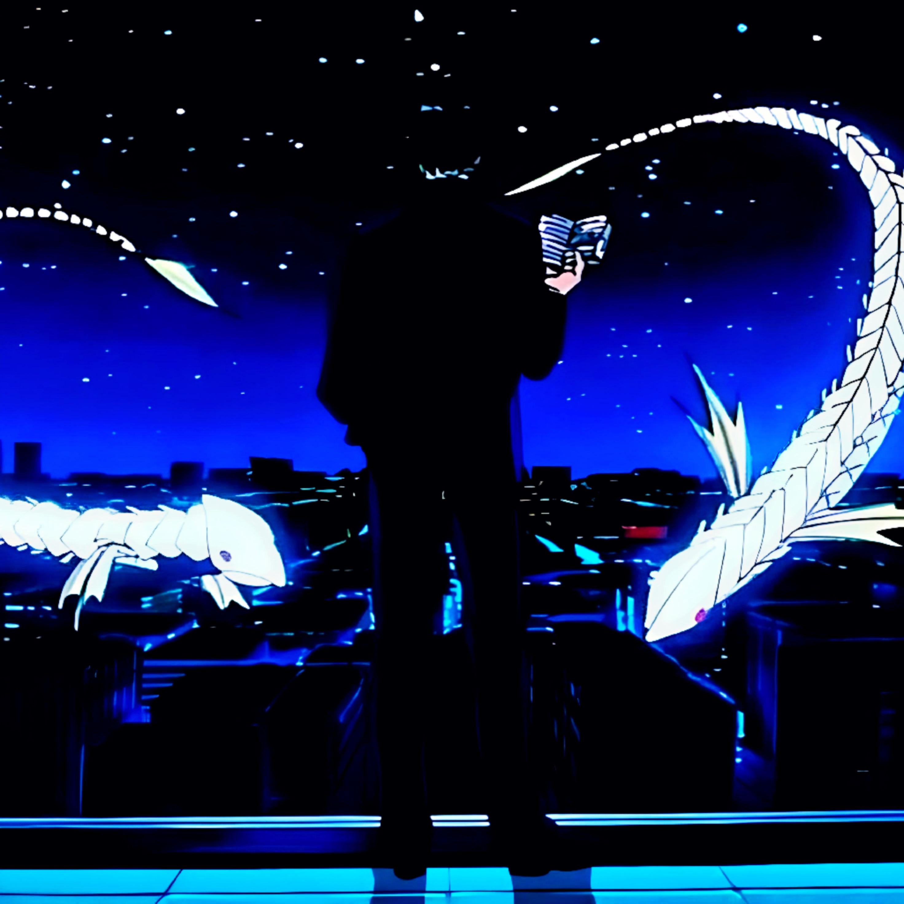

 

> *"You should enjoy the little detours. To the fullest. Because that's where you'll find the things more important than what you want."*
> — Ging Freecss, Hunter × Hunter

---

## About

I'm a 20-year-old engineer from **Delhi, India**, focused on **AI/ML systems engineering**. I like building things properly — design first, document the decisions, ship, then iterate. Currently building [PAOS](https://github.com/civang/PAOS), a personal AI operating system designed to last a decade.

Off the keyboard: music on loop, and a long-standing love for anime — *Hunter × Hunter* and *One Piece* above all.

## Stack

## Featured Work

| Project | Description |
|:---|:---|
| **[PAOS](https://github.com/civang/PAOS)** | Personal AI Operating System — architecture-first monorepo with ADRs, design docs, templates, and a prompt library. Design before code. |
| **paos-core** | The engine behind PAOS: contracts-first library design (`paos-contracts → core → agents → cli`). In development. |
| **RAG + Evaluation Harness** | Next flagship — LLM retrieval systems that are actually measured, with a proper eval suite. Planned. |

## GitHub

  

## Contact

 

